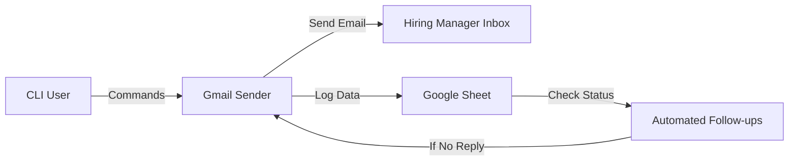

-----

# 🌐 Job Application Automation System

**Automate Email Outreach • Track Applications • Send Follow-ups • Save Hours Every Week**

> **Created by Berkane Aimen** — Unity Developer & Automation Engineer

-----

## 📖 Overview

This CLI tool automates the entire job application workflow. Whether you apply to 10 jobs a day or 200, this tool eliminates copy-pasting, repetitive emails, broken tracking, and follow-up chaos.

**Key Features:**

  * **Gmail API Integration:** Send applications & attachments with a single command.
  * **Google Sheets Tracking:** Automatically log every application in real-time.
  * **Multi-language Support:** Native support for English (`en`) and French (`fr`) templates.
  * **Smart Follow-ups:** Automated follow-up scheduling with bounce detection.
  * **Rich UI:** Beautiful, colored CLI output for a smooth user experience.

-----

## 🧭 Workflow



-----

## 🚀 Quickstart

Get everything running in under 30 seconds.

### 1\. Installation

```bash
# Clone the repository
git clone https://github.com/your-repo/job-automation.git
cd job-automation

# Install dependencies
pip install -r requirements.txt
```

### 2\. Configuration

Copy the example environment file and configure your settings:

```bash
cp .env.example .env
```

*Edit `.env` to set your specific paths and preferences (see [Environment Variables](https://www.google.com/search?q=%23-environment-variables-env) below).*

### 3\. Google Authentication

1.  **Enable APIs:** Go to Google Cloud Console and enable **Gmail API** and **Google Sheets API**.
2.  **Credentials:** Download `oauth_credentials.json` and place it in the `credentials/` folder.
3.  **Initialize:**
    ```bash
    python run.py init
    ```
    *This will trigger the OAuth login, create headers in your Sheet, and save your token.*

-----

## 🖥️ Usage Guide

### 📨 1. Send Job Applications

Send an email with your CV automatically attached based on the language selected.

**Basic English Application:**

```bash
python run.py send -e hr@company.com -l en
```

**Advanced Application (Specific Company & Role):**

```bash
python run.py send \
  -e jobs@tesla.com \
  -l en \
  -c Tesla \
  -p "Instrumentation Engineer" \
  -a Aimen_CV.pdf
```

### 🧾 2. Log Without Sending

If you applied via a web portal (LinkedIn/Indeed) but want to track it in your sheet:

```bash
python run.py add -e hr@company.com -l fr -c "Entreprise X"
```

### 🔁 3. Process Follow-ups

The engine checks your Sheet for applications older than `FOLLOWUP_DAYS`.

```bash
# Dry run (see what would happen without sending)
python run.py followups --dry-run

# Execute follow-ups
python run.py followups
```

### 📊 4. Check Status

Check the status of a specific application UUID:

```bash
python run.py status abc123-uuid
```

-----

## 📁 Project Structure

```bash
src/
 ├── auth.py          # Google Auth (OAuth + Service Account)
 ├── mailer.py        # Gmail sending + attachments + retries
 ├── sheets.py        # Sheets client (add/update/log)
 ├── followup.py      # Follow-up automation engine
 ├── ui_cli.py        # Typer-powered CLI interface
 ├── attachments.py   # Smart attachment selector
 ├── utils.py         # Helper functions
attachments/
 ├── en/              # English CVs/Cover Letters
 └── fr/              # French CVs/Cover Letters
credentials/
 ├── oauth_credentials.json
 ├── token.json
 └── service_account.json
```

-----

## 🧩 Environment Variables (.env)

| Variable | Description | Example |
| :--- | :--- | :--- |
| `AUTH_MODE` | Authentication method | `oauth` |
| `SPREADSHEET_ID` | ID from your Google Sheet URL | `1BxiMvs...` |
| `GMAIL_USER_EMAIL` | Your sending address | `me@gmail.com` |
| `FOLLOWUP_DAYS` | Days to wait before follow-up | `7` |
| `TIMEZONE` | Timezone for timestamps | `UTC` |
| `ATTACHMENT_FOLDER_EN` | Path to EN documents | `attachments/en` |

-----

## 🛠 Troubleshooting

| Issue | Solution |
| :--- | :--- |
| **Gmail API Quota Errors** | Increase `DEFAULT_DELAY_BETWEEN_EMAILS` in `.env` to 3 or 5 seconds. |
| **OAuth Window Not Opening** | Run a test send command: `python run.py send -e test@example.com`. |
| **Attachment Not Found** | Ensure your `attachments/en/` or `attachments/fr/` folders contain `.pdf` or `.docx` files. |

-----

## 🛣 Roadmap

  - [x] Multi-language sending
  - [x] Automated follow-ups
  - [x] Bounce detection
  - [x] CLI workflow polish
  - [ ] Template System (Customizable HTML/Text templates)
  - [ ] In-app Analytics (Response rates, A/B testing)
  - [ ] GUI Desktop App

-----

## 🙌 Credits

**Berkane Aimen**
*Unity Engineer • Automation Developer • Upwork Top Rated*

For support, ideas, or contributions, feel free to reach out or open an issue.

-----